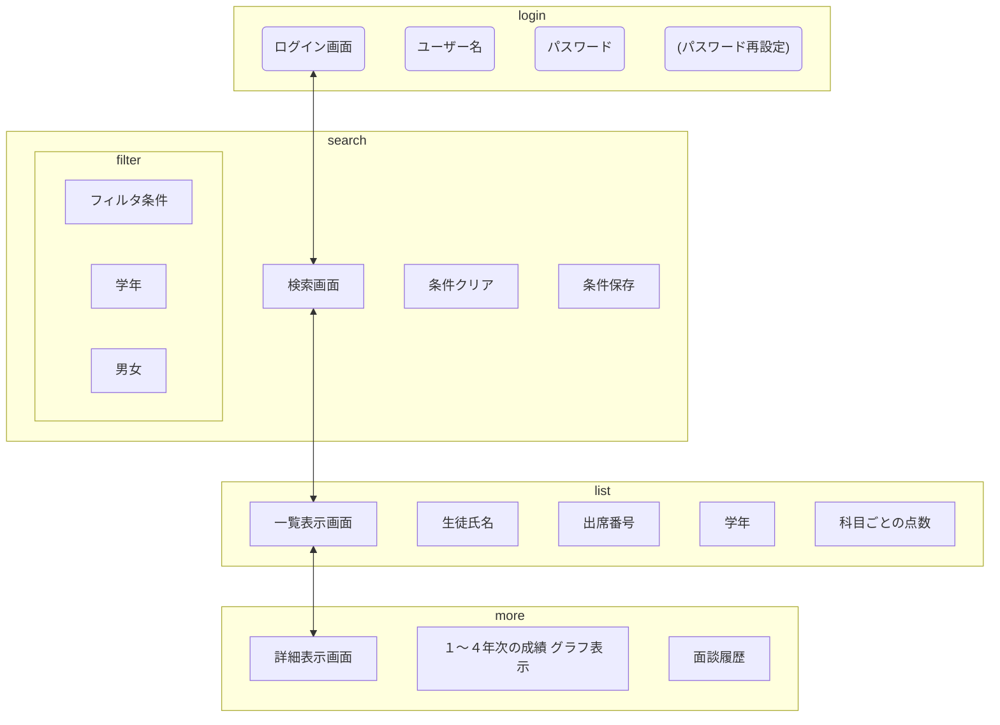

sequenceDiagram
    participant User
    participant System
    participant Database

```mermaid

flowchart TB
subgraph login
  node_1("ログイン画面")
  node_1_1("ユーザー名")
  node_1_2("パスワード")
  node_1_3("(パスワード再設定)")
end

subgraph search
  node_2["検索画面"]
subgraph filter
    node_2_1["フィルタ条件"]
    node_2_1_1["学年"]
    node_2_1_!["男女"]
end
  node_2_2["条件クリア"]
  node_2_3["条件保存"]
end

subgraph list
  node_3["一覧表示画面"]
  node_3_1["生徒氏名"]
  node_3_2["出席番号"]
  node_3_3["学年"]
  node_3_4["科目ごとの点数"]
end

subgraph more
  node_4["詳細表示画面"]
  node_4_1["１〜４年次の成績 グラフ表示"]
  node_4_2["面談履歴"]
end

%%遷移先ルートは前後のみに絞る。
  node_1 <--> node_2
  node_2 <--> node_3
  node_3 <--> node_4


```
