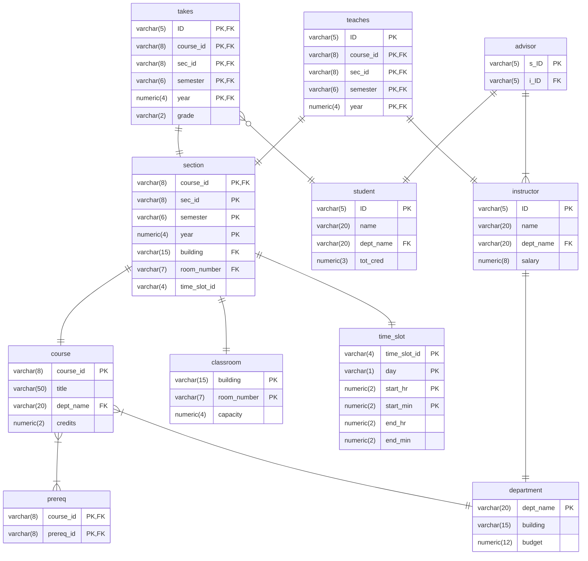

```mermaid
erDiagram
takes ||--|| section:""
takes }o--|| student:""
advisor ||--|| student:""
advisor ||--|{ instructor:""
instructor ||--|| department:""
course }|--|{ prereq:""
course }|--|| department:""
section ||--|| course:""
section ||--|| classroom:""
section ||--|| time_slot:""
teaches ||--|| section:""
teaches ||--|| instructor:""


    classroom{
        varchar(15) building PK
        varchar(7) room_number PK
        numeric(4) capacity
    }
    department{
        varchar(20) dept_name PK
        varchar(15) building
        numeric(12) budget
    }
    course{
        varchar(8) course_id PK
        varchar(50) title
        varchar(20) dept_name FK
        numeric(2) credits
    }
    instructor{
        varchar(5) ID PK                
        varchar(20) name                 
        varchar(20) dept_name FK           
        numeric(8) salary            
    }
    section{
        varchar(8) course_id PK,FK            
        varchar(8) sec_id PK                
        varchar(6) semester PK        
        numeric(4) year PK
        varchar(15) building FK    
        varchar(7) room_number FK    
        varchar(4) time_slot_id    
    }
    teaches{
        varchar(5) ID PK                
        varchar(8) course_id  PK,FK          
        varchar(8) sec_id  PK,FK                
        varchar(6) semester  PK,FK           
        numeric(4) year  PK,FK                
    }
    student{
        varchar(5)  ID PK
        varchar(20) name 
        varchar(20) dept_name FK
        numeric(3)  tot_cred
    }
    takes{
        varchar(5)  ID PK,FK 
        varchar(8)  course_id  PK,FK
        varchar(8)  sec_id  PK,FK
        varchar(6)  semester  PK,FK
        numeric(4)  year   PK,FK
        varchar(2)  grade
    }
    advisor{
        varchar(5) s_ID PK
        varchar(5) i_ID FK
    }
    time_slot{
        varchar(4) time_slot_id PK
        varchar(1) day PK
        numeric(2) start_hr PK
        numeric(2) start_min PK
        numeric(2) end_hr
        numeric(2) end_min
    }
    prereq{
        varchar(8) course_id PK,FK
        varchar(8) prereq_id PK,FK
    }
```
